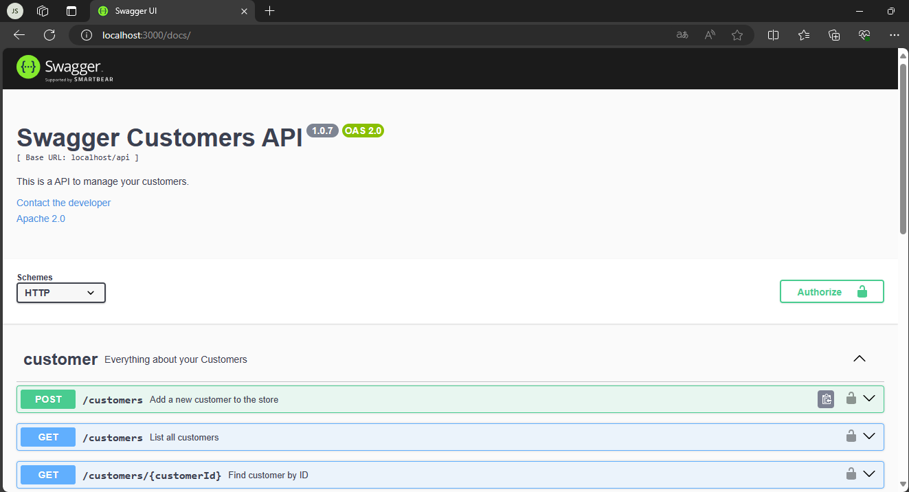
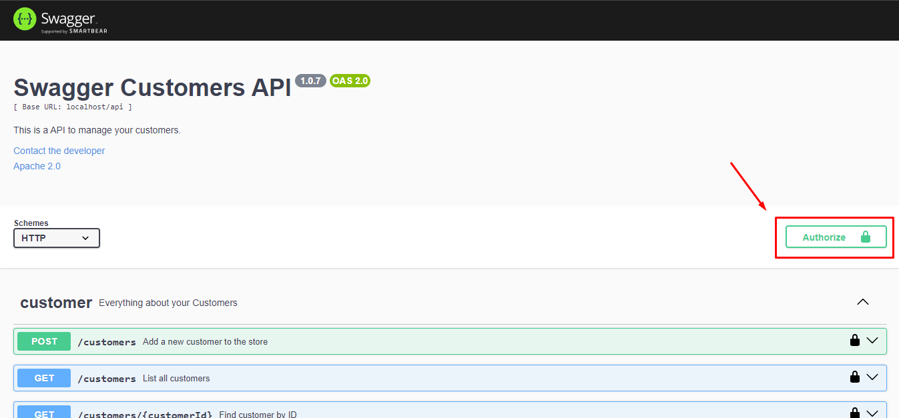
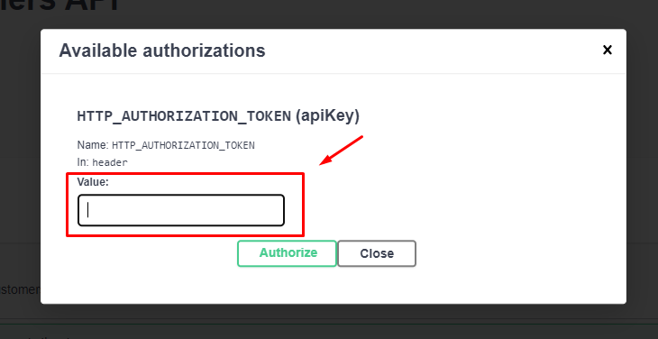

    <h1 align="center">
        Customers API 
        
    </h1>

## 📚 Introdução
Bem-vindo ao projeto Customers API, desenvolvido por mim ©Jessé Jorge Santana.

Esse projeto é uma API RESTful de cadastro simples de clientes, desenvolvida em PHP puro com documentação Swagger. 

Em caso de quaisquer dúvidas, você pode entrar em contato comigo das seguintes formas:

* 📞 - WhatsApp: +55 (11) 99335-5997
* 📧 - E-mail: jesse-jjs@hotmail.com

## 📋 Requisitos
- PHP 8.2.^
- MySQL 8.^
- Node 20.11.^

## 🛠️ Estrutura do Projeto
O projeto, apesar de ter sido desenvolvido em PHP puro segue, em linhas gerais, a mesma organização de pastas do framework Laravel, dessa forma padronizando a estrutura e promovendo uma melhor organização do código.

## ⚙️ Instalação
Para instalar o projeto siga o seguinte passo a passo:

1. Clone o repositório remoto do projeto;

2. Se estiver utilizando o XAMPP coloque o projeto na pasta `htdocs`, caso esteja utilizando um servidor Apache, certifique-se de utilizar a porta 80;

3. Crie uma cópia do arquivo `env-example.php` e renomeie para `env.php`, esse arquivo é responsável por definir as variáveis de ambiente do projeto;

4. Após criar a cópia e renomear o arquivo para `env.php`, defina os valores das variáveis de conexão com o banco de dados MYSQL conforme o seu ambiente, atente-se também ao preenchimento da variável `AUTHORIZATION_TOKEN`, o valor dela será o mesmo a ser utilizado no cabeçalho de autorização para realizar as requisições HTTP para a API;

5. Vá até a pasta `database/migrations`, abra o terminal e rode o seguinte comando `php RunMigrations.php`, esse comando será responsável por realizar a criação do banco de dados, caso ele não exista, e também criará a tabela *customers* que armazena os dados relativos aos clientes na aplicação.

6. Abra o terminal na pasta raiz do projeto e rode o comando `npm install` para instalar as dependências relativas à documentação Swagger da API;

7. Certifique-se que a porta 3000 está disponível e, posteriormente, rode o comando `npm run start` para inicializar o servidor Node para a documentação Swagger da API;

8. Após, acesse o seguinte link: `http://localhost:3000/docs/`. A seguinte tela de documentação deverá ser exibida:

9. Para testar a API poderá ser utilizada a documentação Swagger, para isso é necessário que seja definido o valor do cabeçalho `HTTP_AUTHORIZATION_TOKEN` para que as requisições sejam autenticadas pela API, esse valor deverá ser o mesmo definido na variável de ambiente `AUTHORIZATION_TOKEN`. Para definir o cabeçalho de autorização clique em **_Authorize_** e preencha o campo, conforme mostram as imagens a seguir:

⚠️ **Atenção!** - Para que a documentação Swagger possa ser utilizada como um 'cliente HTTP', a pasta do projeto deverá seguir com o nome `api` e deverá ser colocada diretamente na raiz da pasta `htdocs`, para que a base url da API fique da seguinte forma: `http://localhost/api`. Em caso de divergência na base url no ambiente de instalação recomenda-se a utilização do Postman ou outro cliente HTTP semelhante.

